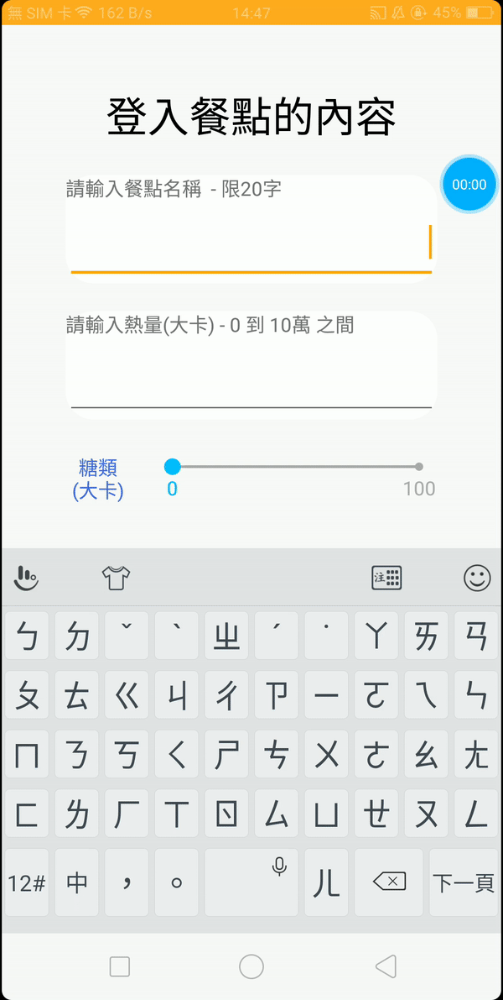

# Diet-Note 飲食管家 - 關注您的健康
這是一個可以記錄及觀察每日飲食內容的應用程式。
<br/>輸入每日餐點的組成及熱量，您的飲食習慣。
<br/>適合每一個想要紀錄飲食內容和觀察飲食組成的每一個人。

## screenshot



## libraries
- androidx (viewmodel / data-binding / livedata / room / paging)
- [Circular-Progress-View](https://github.com/VaibhavLakhera/Circular-Progress-View)
- [material-dialogs](https://github.com/afollestad/material-dialogs)
- [AVLoadingIndicatorView](https://github.com/81813780/AVLoadingIndicatorView)
- [Android-ProgressViews](https://github.com/zekapp/Android-ProgressViews)
- [BubbleSeekBar](https://github.com/woxingxiao/BubbleSeekBar)
- [ExpansionPanel](https://github.com/florent37/ExpansionPanel)
- [SwipeLayout](https://github.com/zerobranch/SwipeLayout)
- [BottomDialog](https://github.com/raphaelbussa/BottomDialog)
- [spots-dialog](https://github.com/dybarsky/spots-dialog)

## License
```
Copyright 2020 John Hsu
        
Licensed under the Apache License, Version 2.0 (the "License");
you may not use this file except in compliance with the License.
You may obtain a copy of the License at
        
    http://www.apache.org/licenses/LICENSE-2.0
        
Unless required by applicable law or agreed to in writing, software
distributed under the License is distributed on an "AS IS" BASIS,
WITHOUT WARRANTIES OR CONDITIONS OF ANY KIND, either express or implied.
See the License for the specific language governing permissions and
limitations under the License.
```
